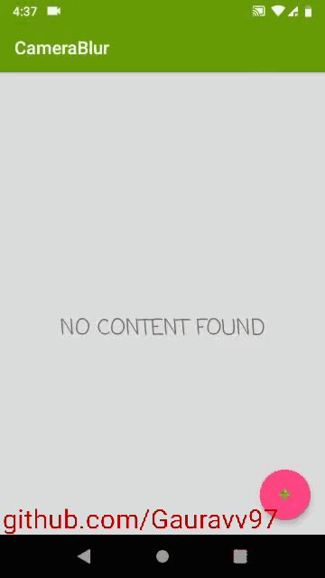
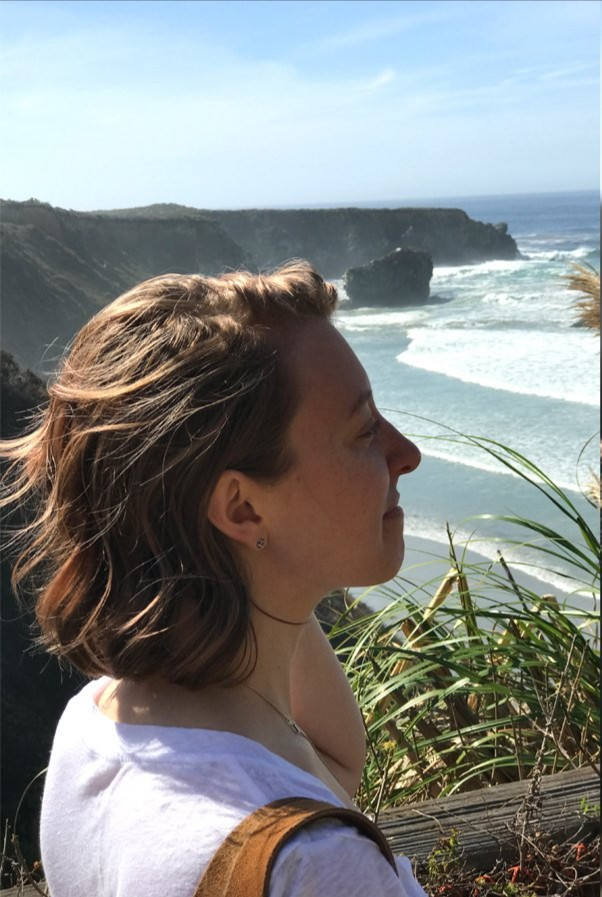
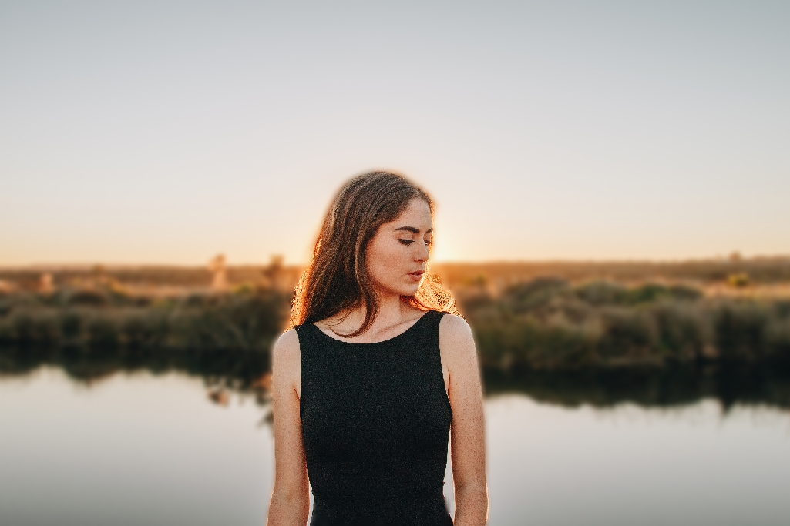
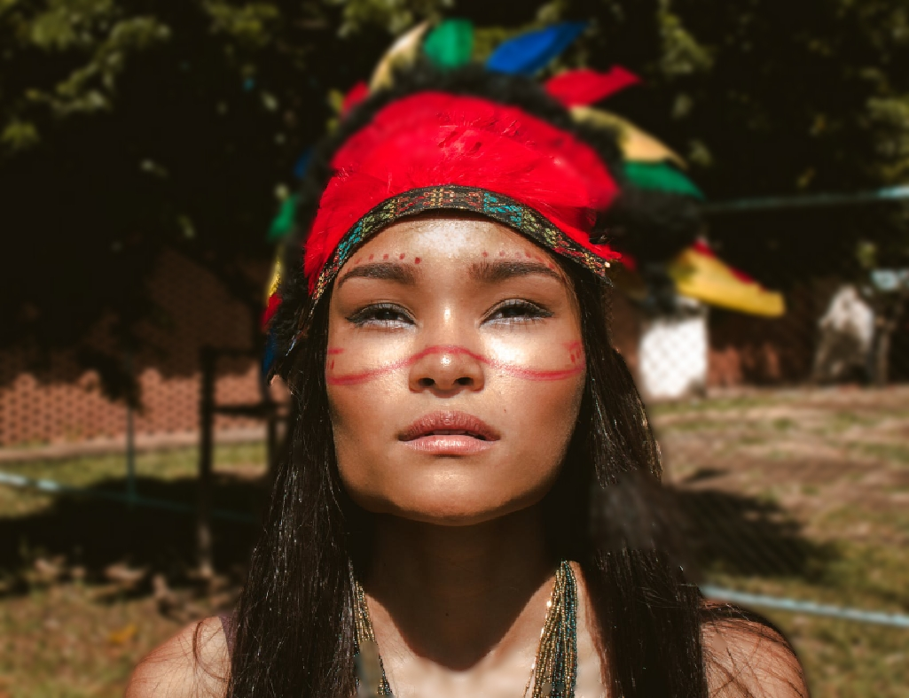

CameraBlur:Portrait mode using DeeplabV3+ Semantic Image Segmentation 
=====================================================================
A simple android app to implement Portrait mode using a single sensor like in Pixel 2 (well not exactly exactly like Pixel 2's). This app allows you to either click image from your phone or select an image from storage and apply the blur. This app can run on ARM32 bit `ARM v7A` as well as ARM64 `ARMv8-A`.

## Downloads

Download apk from [here](https://github.com/Gauravv97/CameraBlur/raw/master/apk/v1.0.0/app-debug.apk)

## Demo



## Some Samples

<p align="center">
       </br>
       </br>
    
</p>


## Features

* Select image from storage or click them using camera
* Blur a variety of subjects (most centered subject will be selected rest will be background).
* SoftBlur around edges

## For developers

I have 3 pre-trained models of different crop sizes `Default 1025 px`. You can use any one of them but with increased crop size the processing time also increases (by a lot), so use them as per your requirement. Crop size is the size of the image that the input image will be resized to and sent for processing. The output dimensions are always less than crop size.

For using 1537 px: Copy `InputSize 1537px\frozen_inference_graph.pb`and paste it in `CameraBlur\app\src\main\assets\`.

Then change 
`CameraBlur\app\src\main\java\com\anondev\gaurav\camerablur\DeeplabProcessor.java`line 28 

From 

	public final static int INPUT_SIZE = 1025;

to 

	public final static int INPUT_SIZE = 1537; 

## Changelog

<b>v0.0.2</b>  Added SoftBlur around edges

<b>v0.0.3</b>  Implemented blur using [Android RenderScript](https://developer.android.com/guide/topics/renderscript/compute)


<b>v1.0.0</b>  Exported MobilenetV2 model with depth multiplier=0.5([mobilenetv2_dm05_coco_voc_trainaug](http://download.tensorflow.org/models/deeplabv3_mnv2_dm05_pascal_trainaug_2018_10_01.tar.gz) ). Accuracy is slightly reduced but performance gain is extremely high.

## Todo

* [x] Use [Android RenderScript](https://developer.android.com/guide/topics/renderscript/compute) for blurring images(Soon).
* [ ] To add a feature to edit the depth of field in the gallery.
* [ ] Implement tensorflow lite (not possible until tensorflow can quantize deeplabv3 plus model).

## Attributions/Thanks/External code

This application wouldn't have been possible without the great material produced by the community. I would like to give special thanks to the authors of essential parts I've got on the internet and used in the code.:

- DeepLabv3+:
```
@article{deeplabv3plus2018,
  title={Encoder-Decoder with Atrous Separable Convolution for Semantic Image Segmentation},
  author={Liang-Chieh Chen and Yukun Zhu and George Papandreou and Florian Schroff and Hartwig Adam},
  journal={arXiv:1802.02611},
  year={2018}
}
```

- MobileNetv2:

```
@inproceedings{mobilenetv22018,
  title={Inverted Residuals and Linear Bottlenecks: Mobile Networks for Classification, Detection and Segmentation},
  author={Mark Sandler and Andrew Howard and Menglong Zhu and Andrey Zhmoginov and Liang-Chieh Chen},
  booktitle={CVPR},
  year={2018}
}
```


* [Tensorflow's deeplab](https://github.com/tensorflow/models/tree/master/research/deeplab)
* A special thanks to [dailystudio for implementing mobilenet model on TFMobile](https://github.com/dailystudio/ml/tree/master/deeplab) without his help this project wouldn't have been sucessful. Also Without the advice given by [Liang-Chieh Chen](https://github.com/aquariusjay), we couldn't have successfully exported the model to mobile devices.


## Photo Credits

* Marcus Pinho, [Pexels](https://www.pexels.com/photo/woman-wearing-red-and-black-feather-hat-923345/)

* Sonnie Hiles, [unsplash](https://unsplash.com/photos/10wjs03JJv8)

## About

Copyright 2018 Gaurav Chaudhari, and licensed under the Apache License, Version 2.0. No attribution is necessary but it's very much appreciated. Star this project if you like it!


